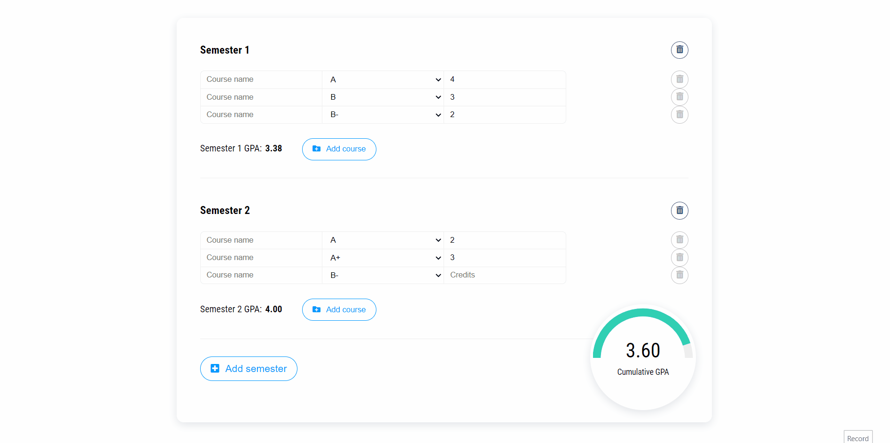

# GPA Calculator

App that allow users to calculate their Grade Point Average (GPA) across multiple semesters and courses. Users can input their grades and credit hours for each course, and the app will automatically calculate their GPA based on the user's inputs.

## Tech Stack

HTML, SASS and Javascript.

## Live Demo

www.tobeworked.com

#### Showcase

## Installation

Simply clone the repo and run the html file on the browser. If you wish to make any changes to the scss file, install a SASS compiler on the code editor of your preference.

## Support

For support, please email pedroenriquedev@gmail.com.
